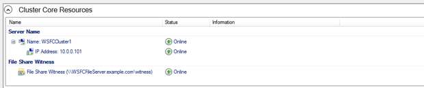
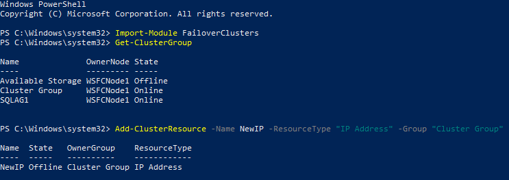
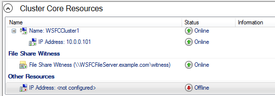
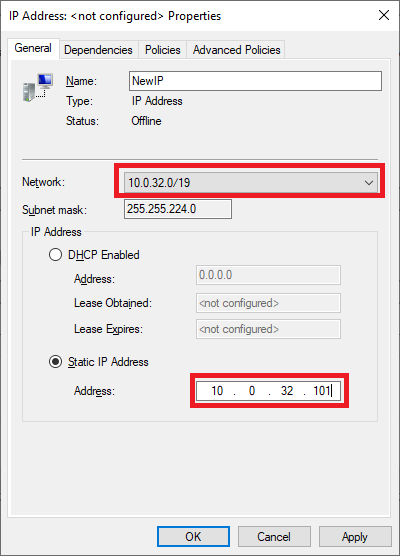
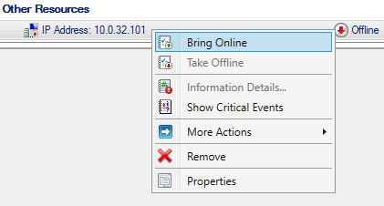
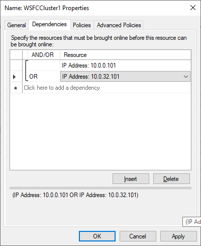
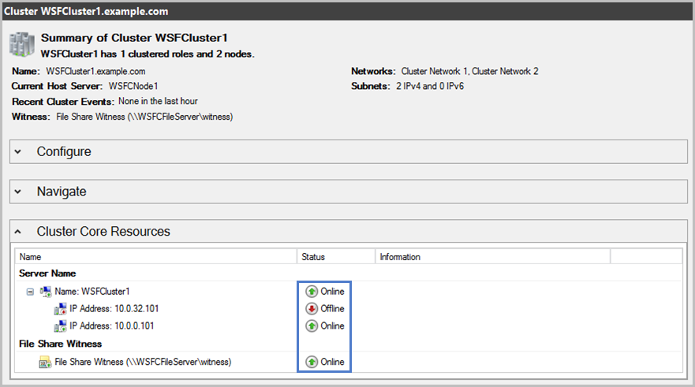
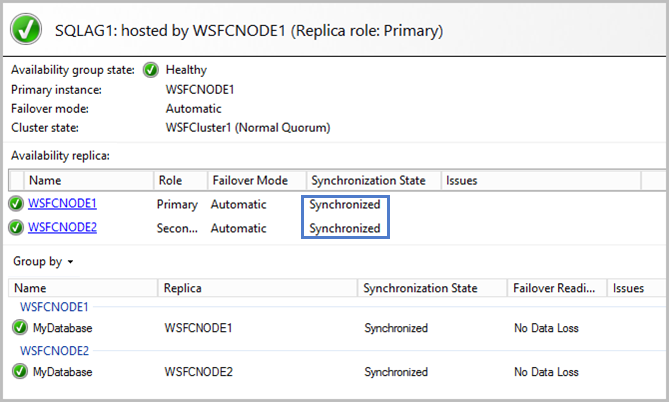
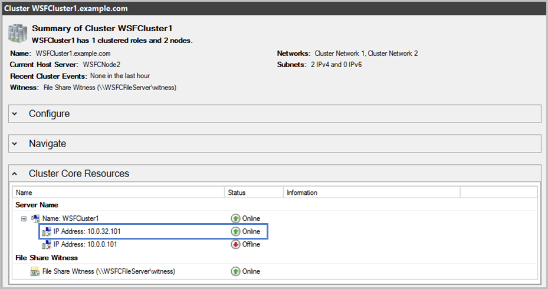
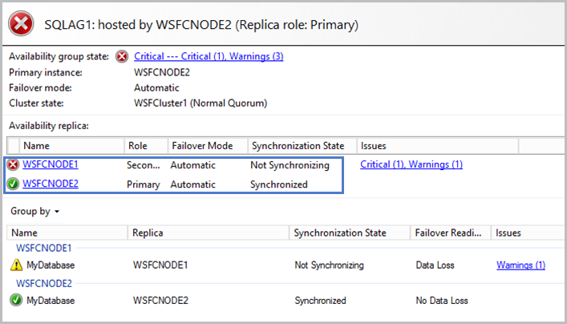

== Post-deployment steps

=== Run Windows updates

In order to ensure the deployed servers' operating systems and installed applications have the latest Microsoft updates, run Windows Update on each server.

. Create an RDP session from the Remote Desktop Gateway server to each deployed server.
. Open the *Settings* application.
. Open *Update & Security*.
. Click *Check for updates*.
. Install any updates and reboot if necessary.

=== Post-launch task

There is a known issue with the Microsoft SQL Quick Start wherein the secondary cluster IP address is not added to the cluster.

[#postlaunch1]
.WSFC Cluster with only one IP address

To add the secondary cluster IP address, do the following.

.  On the first cluster node, launch an elevated Windows PowerShell window and run the following commands.
..  Import-Module FailoverClusters
..  Get-ClusterGroup
+
The name of the Cluster Group should be “Cluster Group.”
+
..  Add-ClusterResource –Name NewIP –ResourceType “IP Address” –Group “Cluster Group”
+
[#postlaunch2]
.Creating a new IP address cluster resource in PowerShell

+
.  From Windows Administrative Tools, open the Failover Clustering management GUI, select the cluster in the left-hand column, and expand the cluster in Core Cluster Resources. The new IP address should be populated.
+
[#postlaunch3]
.New IP address cluster resource

+
.  Open the context (right-click) menu for the new IP address, and choose *Properties*. Select the secondary network, and enter an IP address (i.e. 10.0.32.101), then choose *OK*.
+
[#postlaunch4]
.Setting the IP address cluster resource value

+
.  Open the context (right-click) menu for the new IP address, and choose *Bring Online*.
+
[#postlaunch5]
.Bringing the new IP address online

+
.  To create an “OR” dependency for the cluster, under *Core Cluster Resources*, open the context (right-click) menu for the cluster name, and choose *Properties*.
.  On the *Dependencies* tab, add the new IP address as a resource, change the dependency type to *OR*, and then choose *OK*.
+
[#postlaunch6]
.Adding the new IP address as a cluster dependency

== Test the deployment

NOTE: If you’re using a third Availability Zone as a full SQL Server cluster node (that is, if you set the *Third Availability Zone* parameter to *full*), take that into consideration when following the steps in this section.

Before you put the availability group into production, you should test your deployment and familiarize yourself with the cluster’s behavior during a high availability automatic failover or a disaster recovery event.

.  Open the Remote Desktop Connection application (mstsc.exe), connect to the Remote Desktop Gateway instance, and then connect to the WSFC node (e.g., WSFCNode1) in that zone.
.  On the first cluster node instance, open the Failover Cluster Manager to view the cluster core resources. Make sure that the cluster, one of the two listed IP addresses, and the file-share witness are online.
+
[#postlaunch7]
.Viewing the Failover Cluster Manager

+
.  Open SQL Server Management Studio. In Object Explorer, open the context (right-click) menu for the *Always On High Availability* node, and then launch the dashboard for the availability group (e.g., SQLAG1).
+
.  In the dashboard, view the availability replicas and make sure that their synchronization state is *Synchronized.*
+
[#postlaunch8]
.Viewing the Always On High Availability dashboard with all nodes synchronized

+
.  Make sure that the primary instance and the IP address in the *Cluster Core Resources* pane of Failover Cluster Manager are coordinated. That is, if the primary instance is WSFCNode1, the IP address 10.0.0.101 should be online. If you need to move the cluster core resources to WSFCNode1, you can do so through PowerShell by using the command:
+
Get-ClusterGroup 'Cluster Group' | Move-ClusterGroup -Node WSFCNode1
+
.  Sign in to the AWS Management Console, and open the Amazon EC2 console at https://console.aws.amazon.com/ec2/.
.  Stop the primary instance (e.g., WSFCNode1).
.  Open the Remote Desktop Connection application (mstsc.exe), and then connect to the second cluster node (e.g., WSFCNode2) in Availability Zone 2.
.  On the second cluster node instance, use the Failover Cluster Manager to view the cluster core resources. Note that the IP address that was previously offline (e.g., 10.0.32.101) is now online.
+
[#postlaunch9]
.Viewing the Failover Cluster Manager with WSFCNode1 offline

+
.  Open SQL Server Management Studio. In Object Explorer, open the context (right-click) menu for the *Always On High Availability* node, and launch the dashboard for the availability group (e.g., SQLAG1).
+
.  In the dashboard, view the availability replicas**.** Note that now the primary instance has switched to WSFCNode2, and that the synchronization state of WSFCNode1 is *Not Synchronizing.*
+
[#postlaunch10]
.Always On High Availability dashboard with the first cluster node offline

+
.  At this point, you can start the WSFCNode1 instance again in the Amazon EC2 console. When the instance is online, use the *Failover wizard* in the Availability Group dashboard and switch the primary instance back to WSFCNode1.

NOTE: We recommend that you use `MultiSubnetFailover=true` in your SQL client connection string. https://msdn.microsoft.com/en-us/library/system.data.sqlclient.sqlconnectionstringbuilder.multisubnetfailover.aspx[This property^] enables faster failover for all availability groups in SQL Server and will significantly reduce failover time for single and multi-subnet Always On topologies. If you have legacy clients that need to connect to an availability group listener and cannot use `MultiSubnetFailover`, we recommend that you change the https://msdn.microsoft.com/en-us/library/hh213080.aspx?f=255&MSPPError=-2147217396#RegisterAllProvidersIP[RegisterAllProvidersIP^] setting to 0 by using the `Set-ClusterParameter` cmdlet.