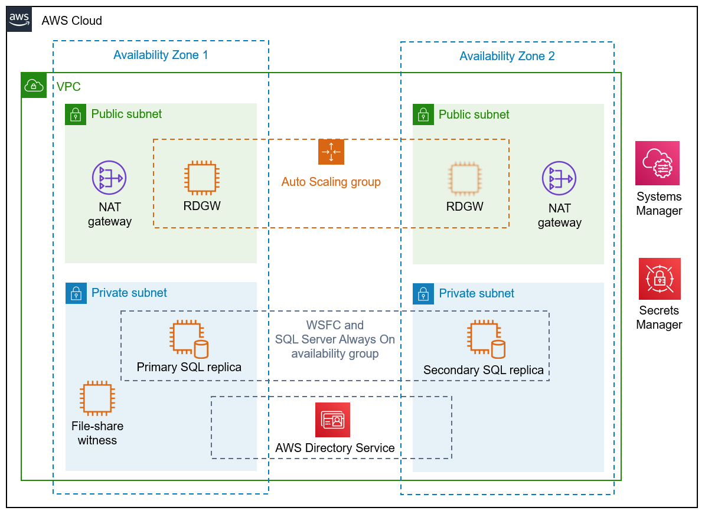
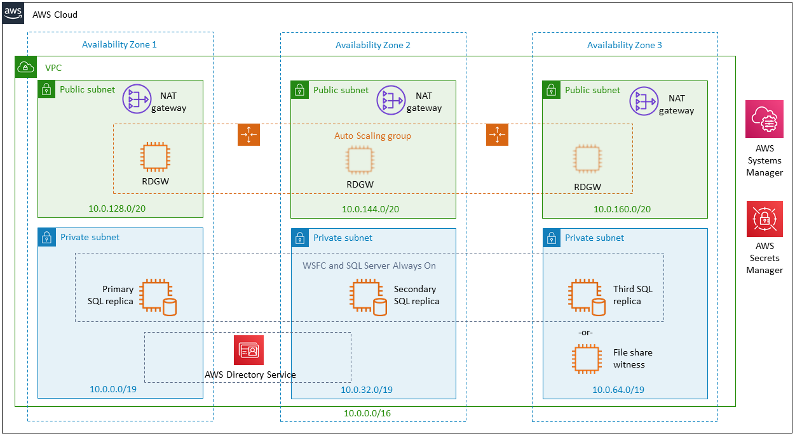
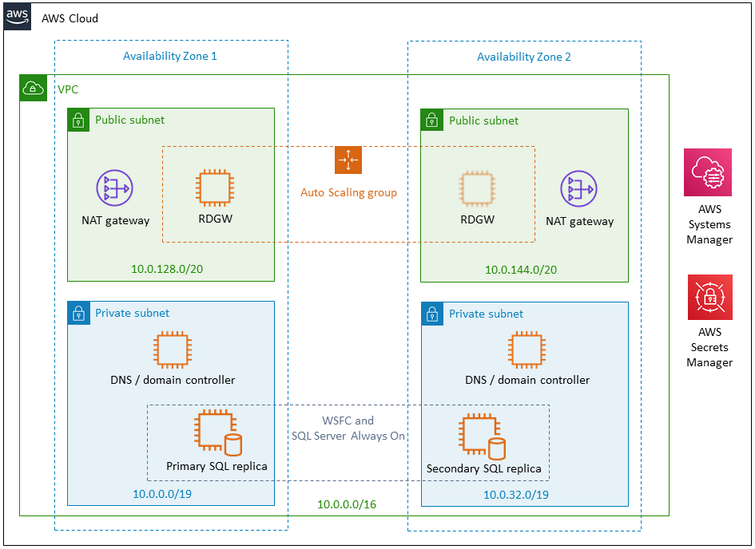
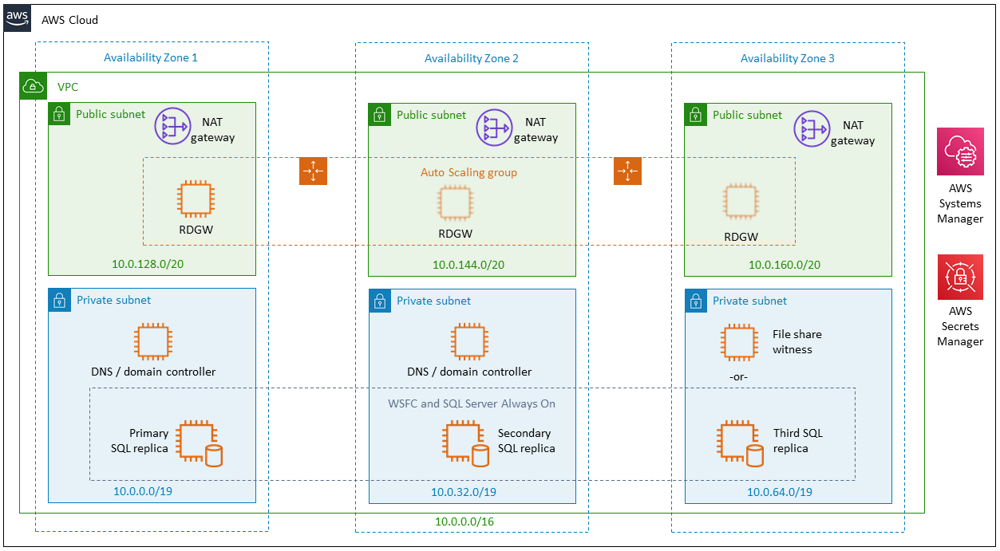

Deploying this Quick Start for a new virtual private cloud (VPC) with
default parameters builds the following {partner-product-short-name} environment in the
AWS Cloud.

:xrefstyle: short
[#architecture1]
.WSFC and SQL Server architecture on AWS (default configuration)

As shown in <<architecture1>>, the Quick Start sets up the following:

* A VPC configured with public and private subnets across two Availability Zones. This provides the network infrastructure for your SQL Server deployment. You can optionally choose a third Availability Zone for the file-share witness or for an additional SQL Server cluster node, as shown in <<architecture2>>.*
+
[#architecture2]
.WSFC and SQL Server architecture on AWS with three Availability Zones

+
* In the public subnets, Windows Server-based Remote Desktop Gateway (RD Gateway) instances and network address translation (NAT) gateways for outbound internet access.*
* In the private subnets, Active Directory Domain Services (AD DS) domain controllers, which are configured by AWS Systems Manager Automation documents.*
+
The Quick Start uses AWS Directory Service to provision AD DS and to manage tasks such as monitoring domain controllers, and configuring backups and snapshots. You can also choose to add AD DS domain controllers as EC2 instances to the architecture and manage these yourself, as shown in <<architecture3>> and <<architecture4>>.
+
[#architecture3]
.WSFC and SQL Server architecture with AD DS on Amazon EC2

+
[#architecture4]
.WSFC and SQL Server architecture with three Availability Zones and AD DS on Amazon EC2

+
* In the private subnets, Windows Server-based instances as WSFC nodes, and SQL Server Enterprise edition with SQL Server Always On availability groups on each node. This architecture provides redundant databases along with a witness server to ensure that a quorum can vote for the node to be promoted to primary; you can optionally replace the witness server with an https://aws.amazon.com/fsx/windows/[Amazon FSx for Windows File Server^] file share. The default architecture mirrors an on-premises architecture of two SQL Server instances spanning two subnets placed in two different Availability Zones.
* AWS Secrets Manager for password storage.
* Security groups to ensure the secure flow of traffic between the instances deployed in the VPC.

[.small]#*The template that deploys the Quick Start into an existing VPC skips the components marked by asterisks and prompts you for your existing VPC configuration.#

=== Comparison with SQL Server Failover Cluster Instance ===

To better understand the architecture of the {partner-product-short-name} Quick Start, it's helpful to compare with the https://fwd.aws/EMjnp?[Quick Start for SQL Server Failover Cluster Instance^] (FCI). Both Quick Starts are architected to ensure high availability. Both have EC2 instances clustered using WSFC. Both have database files stored in multiple Availability Zones. What's different is the way each Quick Start accomplishes database high availability.

The FCI-based architecture requires only one SQL Server license. With the FCI Quick Start, database-related files aren't replicated across the WSFC cluster, and SQL Server is not installed in the local file systems. Instead, this Quick Start creates an Amazon FSx file system and installs SQL Server there. The EC2 instances (FCI nodes) share this file system, which also stores all the SQL database files and log files. In addition, this shared file system acts as the cluster's file-share witness.

*The replication-based architecture, on the other hand, requires an SQL Server license for each EC2 instance.* That's because it requires a full installation of SQL Server (Standard or Enterprise edition) on each EC2 instance.

[#replication]
.Replication close up
image::../images/zoom-in-on-replication.png[replication,70%]

As <<replication>> shows, each EC2 instance has a root EBS volume plus three other EBS volumes attached for storing SQL database-related files: the database files themselves, database log files, and `tempdb` files. An https://docs.microsoft.com/en-us/sql/database-engine/availability-groups/windows/overview-of-always-on-availability-groups-sql-server[Always On availability group^] is configured across both servers. Databases installed in the availability group have their database and log files replicated across the cluster. If the primary server in the cluster becomes unavailable, the secondary server is promoted to become the primary, and traffic to the availability group is routed to it. 

=== Advantages and disadvantages ===
The architecture of each SQL Server Quick Start has advantages and disadvantages.

*{partner-product-name} Quick Start:*

* Advantages: 
** The EBS volume type, capacity, and IOPS can be configured, allowing flexibility.
** It supports both AWS-provided licensing and Bring Your Own License models for Microsoft SQL.
* Disadvantage: 
** Each WSFC node with SQL Server installed requires a SQL Server license, increasing cost.

*SQL Server FCI Quick Start:*

* Advantage: It requires only one SQL Server license.
* Disadvantages:
** It relies on an Amazon FSx Multi-AZ file system, which is not supported in all AWS Regions.
** It requires the customer to provide a SQL Server .iso file and license since AWS-provided SQL licensing is not supported.