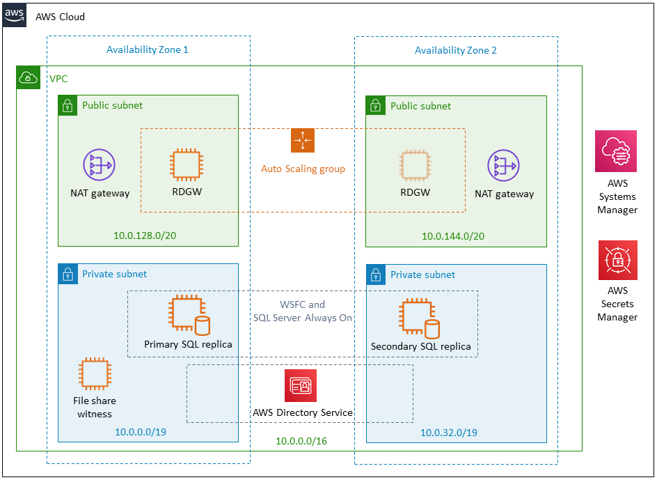

Deploying this Quick Start for a new virtual private cloud (VPC) with
default parameters builds the following {partner-product-short-name} environment in the
AWS Cloud.

// Replace this example diagram with your own. Send us your source PowerPoint file. Be sure to follow our guidelines here : http://(we should include these points on our contributors giude)
:xrefstyle: short
[#architecture1]
.WSFC and SQL Server architecture on AWS (default configuration)

As shown in <<architecture1>>, the Quick Start sets up the following:

* A VPC configured with public and private subnets across two Availability Zones. This provides the network infrastructure for your SQL Server deployment. You can optionally choose a third Availability Zone for the file share witness or for an additional SQL Server cluster node, as shown in Figure 2.*

[#architecture2]
.WSFC and SQL Server architecture on AWS with three Availability Zones
image::../images/image2.png[image,width=648,height=356]

* In the public subnets, Windows Server-based Remote Desktop Gateway (RD Gateway) instances and network address translation (NAT) gateways for outbound internet access.*
* In the private subnets, Active Directory Domain Services (AD DS) domain controllers, which are configured by AWS Systems Manager Automation documents.*
+
The Quick Start uses AWS Directory Service to provision AD DS and to manage tasks such as monitoring domain controllers, and configuring backups and snapshots. You can also choose to add AD DS domain controllers as EC2 instances to the architecture and manage these yourself, as shown in Figures 3 and 4.

[#architecture3]
.WSFC and SQL Server architecture with AD DS on Amazon EC2
image::../images/image3.png[image,width=648,height=471]

[#architecture4]
.WSFC and SQL Server architecture with three Availability Zones and AD DS on Amazon EC2
image::../images/image4.png[image,width=648,height=357]

* In the private subnets, Windows Server-based instances as WSFC nodes, and SQL Server Enterprise edition with SQL Server Always On availability groups on each node. This architecture provides redundant databases along with a witness server to ensure that a quorum can vote for the node to be promoted to primary; the witness server can optionally be replaced with an Amazon FSx Windows file share. The default architecture mirrors an on-premises architecture of two SQL Server instances spanning two subnets placed in two different Availability Zones.
* AWS Secrets Manager for password storage.
* Security groups to ensure the secure flow of traffic between the instances deployed in the VPC.

[.small]#*The template that deploys the Quick Start into an existing VPC skips the components marked by asterisks and prompts you for your existing VPC configuration.#
