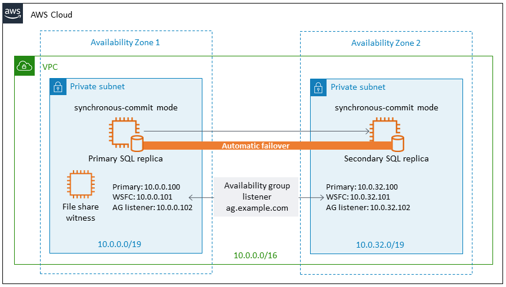
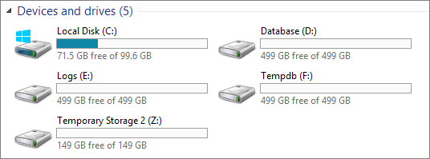
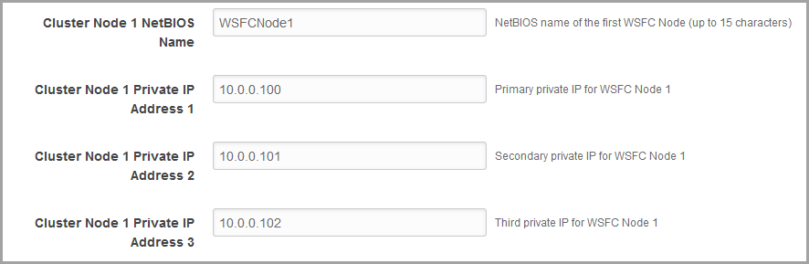

The architecture built by this Quick Start supports AWS best practices for high availability and security.

[[high-availability-and-disaster-recovery]]
=== High Availability and disaster recovery

Amazon EC2 provides the ability to place instances in multiple locations composed of AWS Regions and Availability Zones. Regions are dispersed and located in separate geographic areas. Availability Zones are distinct locations within a Region that are engineered to be isolated from failures in other Availability Zones and that provide inexpensive, low-latency network connectivity to other Availability Zones in the same Region.

By launching your instances in separate Regions, you can design your application to be closer to specific customers or to meet legal or other requirements. By launching your instances in separate Availability Zones, you can protect your applications from the failure of a single location. WSFC provides infrastructure features that complement the high availability and disaster recovery scenarios supported in the AWS Cloud.

[[automatic-failover]]
=== Automatic failover

Deploying the Quick Start with the *default parameters* configures a two-node automatic failover cluster with a file-share witness. On this cluster, it deploys a SQL Server Always On availability group with two availability replicas.

[#prereq1]
.SQL Server Always On availability groups and automatic failover
 

[[_Deployment_Scenarios]]The Quick Start implementation supports the following scenarios:

* Protection from the failure of a single instance
* Automatic failover between cluster nodes
* Automatic failover between Availability Zones

However, the Quick Start default implementation doesn’t provide automatic failover in every case. For example, the loss of Availability Zone 1, which contains the primary node and file-share witness, would prevent automatic failover to Availability Zone 2. This is because the cluster would fail as it loses quorum. In this scenario, you could follow manual disaster recovery steps that include restarting the cluster service and forcing quorum on the second cluster node (e.g., WSFCNode2) to restore application availability. The Quick Start also provides an option to deploy into three Availability Zones. This deployment option can mitigate this loss of quorum in the case of a failure of a single node. However, you can select this option only in AWS Regions that include three or more Availability Zones; for a current list, see the https://aws.amazon.com/about-aws/global-infrastructure/[AWS Global Infrastructure] webpage.

We recommend that you consult the Microsoft SQL Server documentation and customize some of the steps described in this guide or follow additional steps (e.g., deploy additional cluster nodes and configure them as readable secondary replicas) to deploy a solution that best meets your business, IT, and security requirements.

[[security-groups-and-firewalls]]
=== Security groups and firewalls

When the EC2 instances are launched, they must be associated with a security group, which acts as a stateful firewall. You have complete control over the network traffic entering or leaving the security group, and you can build granular rules that are scoped by protocol, port number, and source or destination IP address or subnet. By default, all traffic egressing a security group is permitted. Ingress traffic, on the other hand, must be configured to allow the appropriate traffic to reach your instances.

The https://d1.awsstatic.com/whitepapers/aws-microsoft-platform-security.pdf[Securing the Microsoft Platform on Amazon Web Services] whitepaper discusses the different methods for securing your AWS infrastructure. Recommendations include providing isolation between application tiers by using security groups. We recommend that you tightly control ingress traffic in order to reduce the attack surface of your EC2 instances.

Domain controllers and member servers require several security group rules to allow traffic for services such as AD DS replication, user authentication, Windows Time services, and Distributed File System (DFS), among others. The WSFC nodes running SQL Server will need to permit several additional ports to communicate with each other as well. Finally, instances launched into the application server tier will need to establish SQL client connections to the WSFC nodes.

The Quick Start creates a number of security groups and rules for you. For a detailed list of port mappings, see the https://docs.aws.amazon.com/quickstart/latest/active-directory-ds/security.html[Security section] of the Active Directory deployment guide.

In addition to security groups, the Windows firewall also needs to be modified on the SQL Server instances. During the bootstrapping process, a script will run on each instance that opens the TCP ports 1433, 1434, 4022, 5022, 5023, and 135 on the Windows firewall.

[[sql-server-enterprise-edition]]
=== SQL Server Enterprise edition

Amazon Machine Images (AMIs) for the SQL Server 2016 and 2017 Enterprise edition are available for launch on AWS, with the limitations discussed in the link:#_Cost_and_Licenses[Costs and licenses] section. If you set the *Amazon-provided SQL Server license* (SQLLicenseProvided) parameter to *no*, this Quick Start automatically connects to the Microsoft download site and installs the trial software for SQL Server Enterprise edition. If you set the parameter to *yes* (which is the default setting), the Quick Start uses the Amazon-provided AMI, which includes a license for SQL Server Enterprise edition.

You’ll find the installation software on each node in the C:\sqlinstall\ folder and the SQL media in the C:\SQLMedia\ folder.

The SQL services are configured to run under the *sqlsa* account that is created in Active Directory. This account is also added to the local administrator groups on each WSFC node.

AWS does not provide installation media for Microsoft software. If you are not using the AWS CloudFormation templates, you can set up a test or evaluation environment by downloading a trial version of SQL Server from the http://www.microsoft.com/evalcenter/[Microsoft Evaluation Center].

[[storage-on-the-wsfc-nodes]]
=== Storage on the WSFC nodes

Storage capacity and performance are key aspects of any production SQL Server installation. Although capacity and performance will vary from one deployment to the next, this Quick Start provides a reference configuration that you can use as a starting point. The AWS CloudFormation template deploys the WSFC nodes using the memory-optimized r5.2xlarge instance type by default.

In an effort to provide highly performant and durable storage, we’ve also included Amazon Elastic Block Store (Amazon EBS) volumes in this reference architecture. EBS volumes are network-attached disk storage, which you can create and attach to EC2 instances. Once these are attached, you can create a file system on top of these volumes, run a database, or use them in any other way you would use a block device. EBS volumes are placed in a specific Availability Zone, where they are automatically replicated to protect you from the failure of a single component.

Provisioned IOPS EBS volumes offer storage with consistent and low-latency performance. They are backed by solid state drives (SSDs) and are designed for applications with I/O-intensive workloads such as databases.

Amazon EBS-optimized instances, such as the R5 instance type, deliver dedicated throughput between Amazon EC2 and Amazon EBS. The dedicated throughput minimizes contention between Amazon EBS I/O and other traffic from your EC2 instance, and provides the best performance for your EBS volumes.

By default, on each WSFC node, the Quick Start deploys three 500-GiB General Purpose SSD volumes to store databases, logs, tempdb, and backups. This is in addition to the root General Purpose SSD volume used by the operating system. This volume type delivers a consistent baseline of 3 IOPS/GiB, which provides a total of 1,500 IOPS per volume for SQL Server database and log volumes. You can customize the volume size, and you can also switch to using dedicated IOPS volumes with the volume you specify. If you need more IOPS per volume, consider using Provisioned IOPS SSD volumes by changing the *SQL Server volume type* and *SQL Server* *volume IOPS* parameters, or use disk striping within Windows.

The default disk layout for SQL Server in this Quick Start uses the following EBS volumes:

* One General Purpose SSD volume (100 GiB) for the operating system (C:)
* One General Purpose SSD volume (500 GiB) to host the SQL Server database files (D:)
* One General Purpose SSD volume (500 GiB) to host the SQL Server log files (E:)
* One General Purpose SSD volume (500 GiB) to host the SQL Server tempdb and backup files (F:)

<<prereq2>> shows the disk layout on each SQL Server node. The Z: drive is instance storage that can be used for ephemeral data, such as the operating system page file. Keep in mind that data on instance storage will be lost when you stop your EC2 instance.

[#prereq2]
.WSFC node disk layout

[[ip-addressing-on-the-wsfc-nodes]]
=== IP addressing on the WSFC nodes

In order to support WSFC and Always On availability group listeners, each node that hosts the SQL Server instances participating in the cluster will need to have three IP addresses assigned:

* One IP address is used as the primary IP address for the instance.
* A second IP address acts as the WSFC IP resource.
* A third IP address is used to host the Always On availability group listener.

When you launch the AWS CloudFormation template, you can specify the addresses for each node. By default, the 10.0.0.0/19, 10.0.32.0/19, and 10.0.64.0/19 CIDR blocks are used for the private subnets.

[#prereq3]
.Defining WSFC node IP addresses

[[windows-server-failover-clustering]]
=== Windows Server Failover Clustering

Once your Windows Server instances have been deployed and domain-joined, you’re ready to build the cluster. The AWS CloudFormation templates carry out this task when deploying the second node. If you use the default template parameter settings, the Quick Start executes Windows PowerShell commands to complete this task by using the https://github.com/PowerShell/xFailOverCluster[xFailOverCluster^] PowerShell DSC module.

You can observe the default configuration for the failover cluster and the availability group by looking at the `Node1Config.ps1` and `CreateAGNode1.ps1` scripts in the https://fwd.aws/Ap76n?[GitHub repository^] for the Quick Start.
